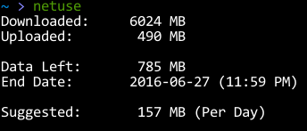

# Network Data Usage

While on windows, I had Networx monitor which used to take care of everything but now I've been forced to write my custom stuff.



## Installation

```bash
sudo ln -s ~/Downloads/netuse.py /usr/bin/netuse
sudo chmod +x /usr/bin/netuse
```

## Todo

* Make this, the data dumping cron job and a network usage appindicator all a part of a single big application.
