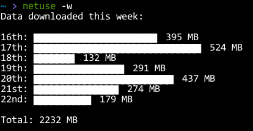
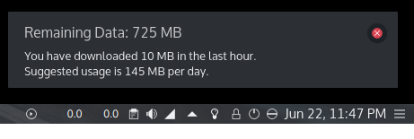

# Network Data Usage

I live on a prepaid internet plan that is usually capped to around 7 GBs per month. Monitoring my bandwidth usage is critical for me.

While on Windows, I used [Networx](https://www.softperfect.com/products/networx/) to track my usage, but I couldn't find anything similar for Linux so I created my own little thing - it's far from being perfect, but hey, it works!

## Screenshots

**Standard statistics:**


**Week at a glance:**



**Hourly Usage Notification:**



## Design

The application has two parts - a bash script that runs as a cron job and dumps transferred bytes to log files, and a Python script that processes the files to generate cumulative statistics like Total data downloaded/uploaded, Data Left and Suggested Usage etc.

I've also added a script that can be run as an hourly cron job to alert you (via desktop notifications) of your usage in the last hour and data remaining.

## Installation

```bash
git clone https://github.com/dufferzafar/netuse ~/Downloads

sudo ln ~/Downloads/netuse/netuse.py /usr/bin/netuse
sudo chmod +x /usr/bin/netuse

cp ~/Downloads/netuse/config.py.example ~/Downloads/netuse/config.py
```

Add this line to your cron tab (`crontab -e`):

    */2 * * * * ~/Downloads/netuse/dumper

To also setup hourly usage notifications:

    0 * * * * /usr/bin/netuse -n

## Future Ideas and TODOs

* Icons in notifications

* Use `bokeh` to chart out the data?

* Handle Day Night Plan calculations.
    * For monthly plans like: 10 GB Day, 10 GB Night.

* Make this, the data dumping cron job and a network usage appindicator all a part of a single big application?
